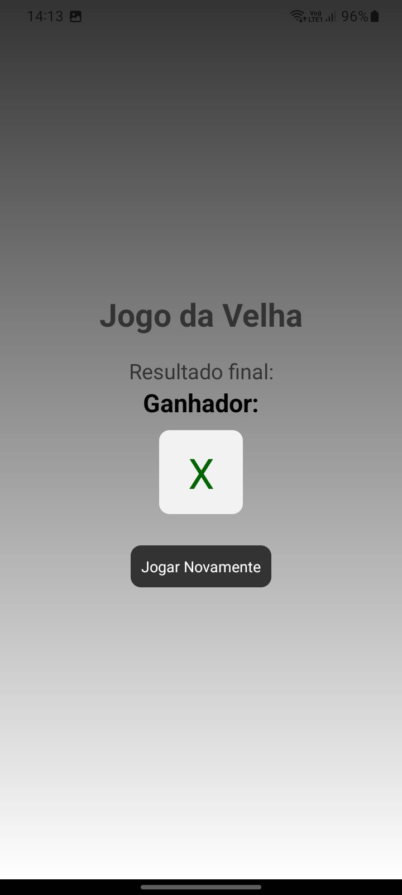

# App_React_Native

## Descrição

Aplicativo de Jogo da Velha desenvolvido com a tecnologia [React Native](https://reactnative.dev/) para a avaliação da disciplina de Técnicas Avançadas de Programação Web e Mobile.

## Primeiros passos
* Faça o download ou clone este repositório;
* Abra seu Terminal/Prompt e navegue até o diretório App_React_Native;
* Abra seu editor de código de preferência;
* Para rodar o projeto digite no terminal: npx expo start;
   - Escaneie o QR Code ou pressione a opção W para abrir o aplicativo via web;  

   
   
   
   
   

Nome do Aluno: **Leonardo Henrique Martucci Gussi**

Créditos: **William Costa (Canal WDEV)**
